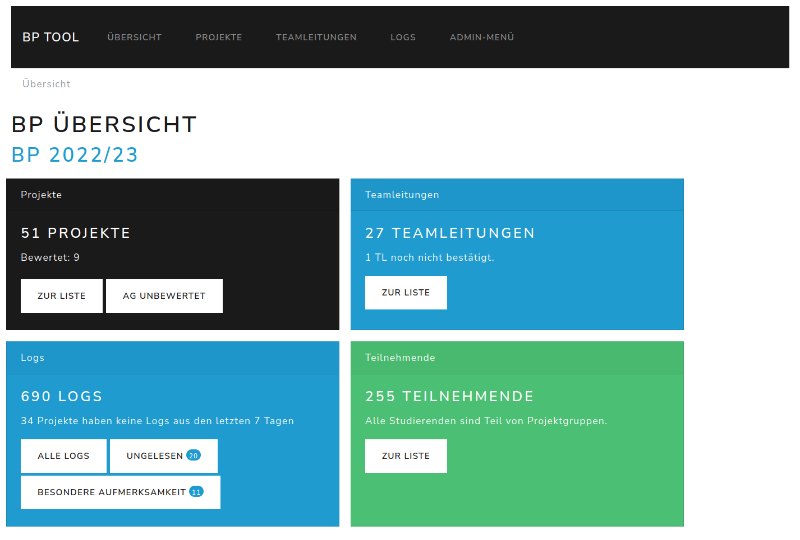

# BP Tool

The "BP Tool" is developed to assist the organization the software lab course "Bachelorpraktikum (BP)".

In the course, groups of 4-5 students work in teams on software projects. Each team is supported by a master student, who reports weekly to the organization team how the team work is going. These reports are written in the BP tool. Additionally, the teams use the BP Tool to track their time and report it to their team support and the organization team.

## Description



**Overview over Students and Projects**
The system provides lists to get an overview over the projects and included students, whole teams can be contacted easily via e-mail.

**Log System**
The system provides the functionality for students to write short reports (logs) on how the team work is going, additionally they can flag an log as *important* and it will be sent to the organization team per mail.

**Time Tracking**
Students have the functionality to track their time spent on the course for different categories, and can see the time tracking from the other members of their team. 

**Overview of grades**
The BP Tool provides functionality to enter the grades for the software development part, as well as the project pitch and project documentation.

## Setup

This repository contains a Django project with a bp app.


### Requirements

BP Tool has two types of requirements: System requirements are dependent on operating system and need to be installed manually beforehand. Python requirements will be installed inside a virtual environment (strongly recommended) during setup.


#### System Requirements

* Python 3.6 (or higher) incl. development tools
* Virtualenv
* for production using uwsgi:
  * C compiler e.g. gcc
  * uwsgi
  * uwsgi Python3 plugin
* for production using Apache (in addition to uwsgi)
  * the mod proxy uwsgi plugin for apache2


#### Python Requirements

Python requirements are listed in ``requirements.txt``. They can be installed with pip using ``-r requirements.txt``.


### Development Setup

* create a new directory that should contain the files in future, e.g. ``mkdir bp-tool``
* change into that directory ``cd bp-tool``
* clone this repository ``git clone URL .``


**Automatic Setup**

1. execute the setup bash script ``Utils/setup.sh``


**Manual Setup**

1. setup a virtual environment using the proper python version ``virtualenv venv -p python3``
1. activate virtualenv ``source venv/bin/activate``
1. install python requirements ``pip install -r requirements.txt``
1. setup necessary database tables etc. ``python manage.py migrate``
1. prepare static files (can be omitted for dev setups) ``python manage.py collectstatic``
1. compile translations ``python manage.py compilemessages``
1. create a privileged user, credentials are entered interactively on CLI ``python manage.py createsuperuser``
1. deactivate virtualenv ``deactivate``


**Development Server**

To start the application for development use ``python manage.py runserver 0:8000`` from the root directory.
*Do not use this for deployment!*

In your browser, access ``http://127.0.0.1:8000/`` and continue from there.


### Deployment Setup

This application can be deployed using a web server as any other Django application.
Remember to use a secret key that is not stored in any repository or similar, and disable DEBUG mode (``settings.py``).

**Step-by-Step Instructions**

1. log into your system with a sudo user
1. install system requirements
1. create a folder, e.g. ``mkdir /srv/bp-tool/``
1. change to the new directory ``cd /srv/bp-tool/``
1. clone this repository ``git clone URL .``
1. setup a virtual environment using the proper python version ``virtualenv venv -p python3``
1. activate virtualenv ``source venv/bin/activate``
1. update tools ``pip install --upgrade setuptools pip wheel``
1. install python requirements ``pip install -r requirements.txt``
1. install db connection client ``pip install psycopg2``
1. create the file ``bptool/settings_secrets.py`` (copy from ``settings_secrets.py.sample``) and fill it with the necessary secrets (e.g. generated by ``tr -dc 'a-z0-9!@#$%^&*(-_=+)' < /dev/urandom | head -c50``) (it is a good idea to restrict read permissions from others)
1. copy additional setting files to server (below ``bptool/settings``)
1. apply migrations ``python manage.py migrate --settings=bptool.settings_production``
1. test db connection using ``python manage.py runserver 0:8888 --settings=bptool.settings_production``   
1. if necessary enable uwsgi proxy plugin for Apache e.g.``a2enmod proxy_uwsgi``
1. edit the apache config to serve the application and the static files, e.g. on a dedicated system in ``/etc/apache2/sites-enabled/000-default.conf`` within the ``VirtualHost`` tag add:

    ```
    Alias /static /srv/bp-tool/static
    <Directory /srv/bp-tool/static>
    Require all granted
    </Directory>

    ProxyPassMatch ^/static/ !
    ProxyPass / uwsgi://127.0.0.1:3036/
    ```

or create a new config (.conf) file (similar to ``apache-bp-tool.conf``) replacing $SUBDOMAIN with the subdomain the system should be available under, and $MAILADDRESS with the e-mail address of your administrator and $PATHTO with the appropriate paths. Copy or symlink it to ``/etc/apache2/sites-available``. Then activate it with ``a2ensite bp-tool``.


1. restart Apache ``sudo apachectl restart``
1. create a dedicated user, e.g. ``adduser django --disabled-login``
1. transfer ownership of the folder to the new user ``chown -R django:django /srv/bp-tool``
1. Copy or symlink the uwsgi config in ``uwsgi-bp-tool.ini`` to ``/etc/uwsgi/apps-available/`` and then symlink it to ``/etc/uwsgi/apps-enabled/`` using e.g., ``ln -s /srv/bp-tool/uwsgi-bp-tool.ini /etc/uwsgi/apps-available/bp-tool.ini`` and ``ln -s /etc/uwsgi/apps-available/bp-tool.ini /etc/uwsgi/apps-enabled/bp-tool.ini``
1. test your uwsgi configuration file with``uwsgi --ini bp-tool.ini``
1. restart uwsgi ``sudo systemctl restart uwsgi``
1. execute the update script ``./Utils/update.sh --prod``


### Updates

To update the setup to the current version on the main branch of the repository use the update script ``utils/update.sh`` or ``utils/update.sh --prod`` in production.

Afterwards, you may check your setup by executing ``utils/check.sh`` or ``utils/check.sh --prod`` in production.


## Developer Notes
* to create a data backup use ````python manage.py dumpdata --indent=2 > db.json --traceback````
